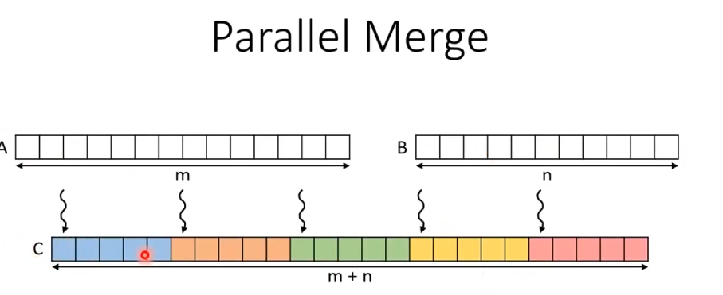
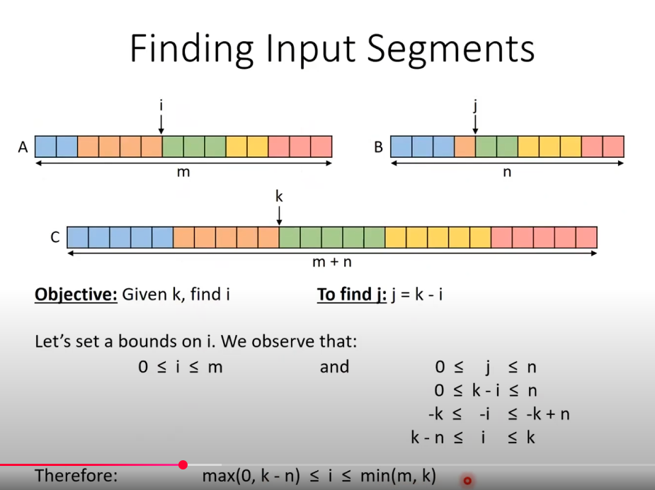

An ordered merge operation takes two ordered lists and combines them into a single ordered list.

Approach: Divide the output into equal size segments and assign a thread to perform sequential merge of each segment.

Then we perform a binary search within the bound until.

Guess is correct: `A[i-1] < B[j] and B[j - 1] < A[i]`  
Guess is too high: `A[i'-1] > B[j']`  
Guess is too low: `B[j''-1] > A[i'']`'  

Problems:
1. Memory accesses are not coalesced
a. during coRank function, each thread performs binary search which has random access
b. during sequential merge, each thread loops through its own segment of consecutive elements.

Optimization:
1. Load the entire block's segment to shared memory
2. Do per thread co-rank and merge in shared memory (non coalesced accesses to be performed in shared memory)